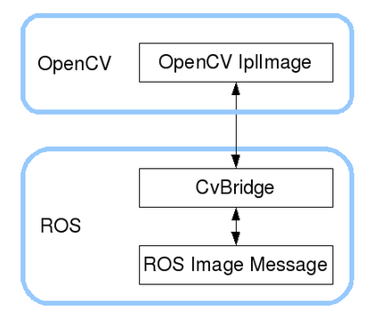

# **A. CV_bridge**
ROS trao đổi dữ liệu hình ảnh giữa các node bằng cách sử dụng message dạng [sensor_msgs/Image](http://docs.ros.org/en/api/sensor_msgs/html/msg/Image.html). Tuy nhiên, để có thể sử dụng OpenCV xử lý hình ảnh, Image message phải được chuyển đổi về dạng Mat của OpenCV

 
### **1. Cài đặt CV_bridge**
### **2. Chuyển đổi giữa Ros message và OpenCV Mat**
# **A. Astra Camera và OpenCV**
