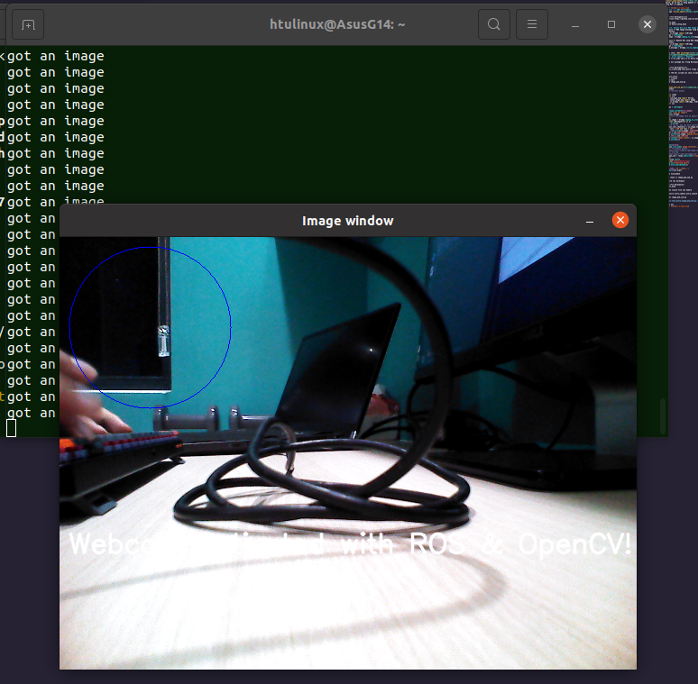

# **A. CV_bridge**
ROS trao đổi dữ liệu hình ảnh giữa các node bằng cách sử dụng message dạng [sensor_msgs/Image](http://docs.ros.org/en/api/sensor_msgs/html/msg/Image.html). Tuy nhiên, để có thể sử dụng OpenCV xử lý hình ảnh, Image message phải được chuyển đổi về dạng Mat của OpenCV

 
### **1. Cài đặt CV_bridge**
Package [vision_opencv](https://github.com/ros-perception/vision_opencv)

```
cd ~/(Tên Workspace)/src
git clone https://github.com/ros-perception/vision_opencv
cd ..
catkin_make
source devel/setup.bash
```
### **2. Chuyển đổi giữa ROS Image message và OpenCV Mat**
* Chuyển từ ROS Image message sang OpenCV Mat
``` Python
from cv_bridge import CvBridge
bridge = CvBridge()
cv_image = bridge.imgmsg_to_cv2(image_message, desired_encoding='passthrough')
```
* Chuyển từ OpenCV Mat sang ROS Image message
```Python
from cv_bridge import CvBridge
bridge = CvBridge()
image_message = bridge.cv2_to_imgmsg(cv_image, encoding="passthrough")
```

* Đọc thêm: [ROS CV_Bridge](http://wiki.ros.org/cv_bridge/Tutorials/ConvertingBetweenROSImagesAndOpenCVImagesPython)
# **A. Astra Camera và OpenCV**
Ví dụ trích xuất ảnh màu từ Astra Camera (Topic /camera/rgb/image_raw)

* Tạo một package mới trong Workspace có tên là test_astra

```
cd ~/(Tên Workspace)/src
catkin_create_pkg test_astra rospy std_msgs sensor_msgs cv_bridge
```
* Tạo thư mục scripts để chứa script python có tên image_pub_sub.py
```
cd test_astra
mkdir scripts
cd scripts
touch image_pub_sub.py

```
* [image_pub_sub.py](src/image_pub_sub.py)
```Python
#!/usr/bin/env python

import rospy
import cv2
from std_msgs.msg import String
from sensor_msgs.msg import Image
from cv_bridge import CvBridge, CvBridgeError
import sys

bridge = CvBridge()

def image_callback(ros_image):
  print ('got an image')
  global bridge
  #convert ros_image into an opencv-compatible image
  try:
    cv_image = bridge.imgmsg_to_cv2(ros_image, "bgr8")
  except CvBridgeError as e:
      print(e)
  #from now on, you can work exactly like with opencv
  (rows,cols,channels) = cv_image.shape
  if cols > 200 and rows > 200 :
      cv2.circle(cv_image, (100,100),90, 255)
  font = cv2.FONT_HERSHEY_SIMPLEX
  cv2.putText(cv_image,'Webcam Activated with ROS & OpenCV!',(10,350), font, 1,(255,255,255),2,cv2.LINE_AA)
  cv2.imshow("Image window", cv_image)
  cv2.waitKey(3)

  
def main(args):
  rospy.init_node('image_converter', anonymous=True)
  #for turtlebot3 waffle
  #image_topic="/camera/rgb/image_raw/compressed"
  #for usb cam
  #image_topic="/usb_cam/image_raw"
  image_sub = rospy.Subscriber("/camera/rgb/image_raw",Image, image_callback)
  try:
    rospy.spin()
  except KeyboardInterrupt:
    print("Shutting down")
  cv2.destroyAllWindows()

if __name__ == '__main__':
    main(sys.argv)
```
* Tạo executable 
```
sudo chmod +x image_pub_sub.py
```
* Build lại workspace
```
cd ~/(Tên Workspace)/
catkin_make
```
* Chạy launch file cho Camera
```
roslaunch astra_camera astra.launch
```
* Chạy image_pub_sub.py
```
rosrun test_astra image_pub_sub.py
```
* Kết quả


